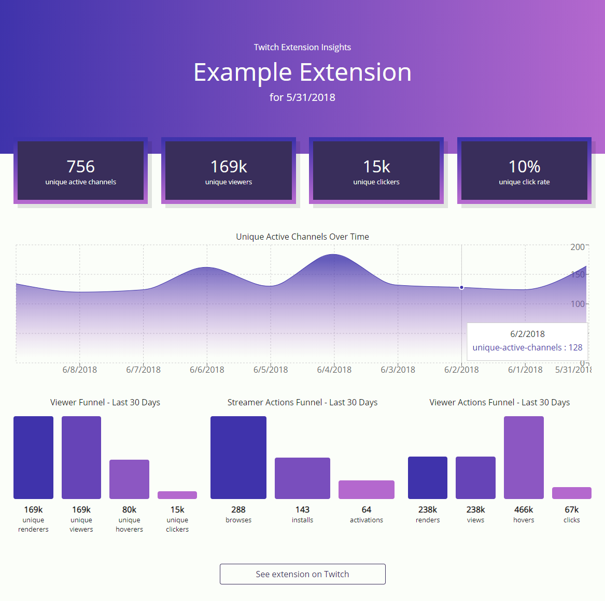

# Twitch Insights Visualization #

A drag-and-drop visualization of your Twitch Insights CSV.



### How to Build ###

Have node v8+ and npm v5+.

```
node --version
npm --version
```

Build to [localhost:8080](http://localhost:8080).

```
npm install
npm start
```

Deploy to [github.io](https://ehgoodenough.github.io/twitch-insights-visualization).

```
npm run deploy
```
